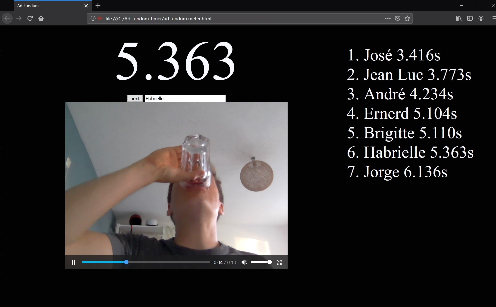

# Ad-fundum-timer
Webpage that registers the time it took to do one ad-fundum drink. Also records you doing the ad-fundum

## Getting started
### Hardware
1. make a sensor that detects when an object (a drink) is above it.
2. Connect the sensor tho a spare numpad (one that you can open to solder some wires)
3. connect the sensor to the `0` key, so that the `0` key is pressed when the drink is above the sensor, and when the `0` key is not pressed when there is no key above it.
4. get a computer (laptop) with either an internal webcam, or a webcam attached to it.

### Software
0. Downlaod the sources of this repo (seel right upper corner)
1. open `ad fundum meter.html` in Firefox browser
2. give access to the use the webcam
3. type in a name in the textfield
    - **NOTE:** don't have a drink above the sensor or else you will constantly type `0`'s
4. press start
5. press somewhere else on the screen
6. put the drink on the sensor.
7. Start drinking
8. put the beer back on the sensor
9. wait for a couple of seconds
10. see yourself drink in all glory

## screenshot

## Good to know
- (currently) only works in Firefox
    - tested in Firefox version 68.0.2 (64-bit)

## Todo 
1. automatically save the recorded video to disk
2. Fix bug that the timer doesn't start when the focus is still on the `StartStopbtn`
3. make this also work in chromium based browsers

## One more thing
- Don't drink yourself stupid!
- Never drink & drive!
- Accomplish someting in your life! Find your talent, use it

For questions: Ask in the `Issues` tab :-)
